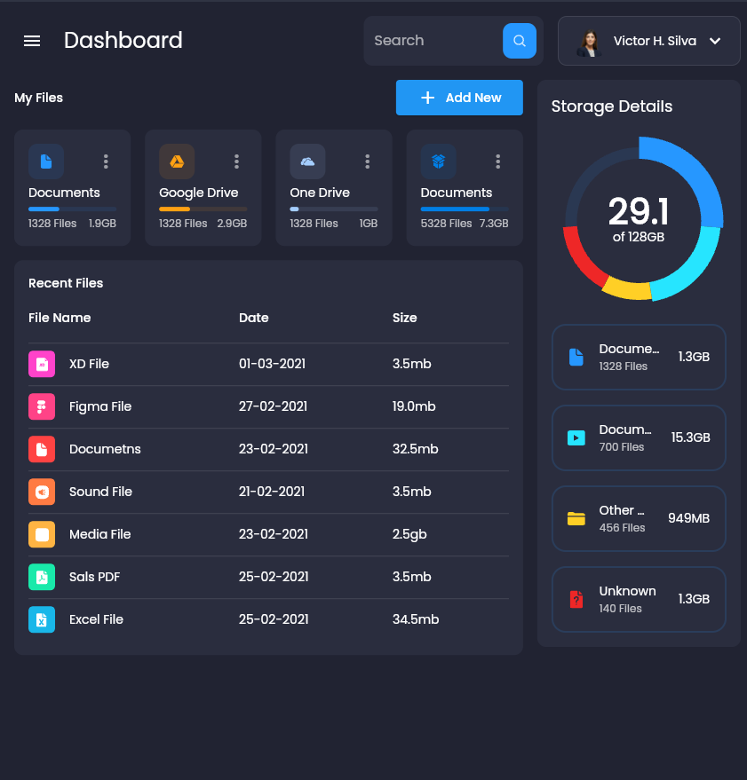

# Responsive Admin Dashboard with Flutter

Project built by watching the  channel. In the video it was possible to learn about how to use the main basic widgets of the flutter framework besides to learn how to apply responsive to the page. 

### Status

Finished 🚀

### Preview

 

### Stack

- google_fonts
- flutter_svg
- fl_chart
- provider

### Author

<b>Victor Silva</b>🚀

&copy; Directs To The Flutter Way Channel.